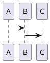
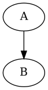

Online PlantUML Web Server
--------------------------

http://www.plantuml.com/plantuml/uml/SyfFKj2rKt3CoKnELR1Io4ZDoSa70000


Run PlantUML from the command line
----------------------------------

1. Create a text file: Product.txt

`
@startuml
class Product
{ 
	+ String: name
	+ double: price
    + void: getPrice()
}
@enduml
`

2. Run PlantUML

`java -jar plantuml.jar Product.txt`


markdown中使用PlantUML
---------------------
```puml
class Product
{
	+String: name
	-double: price
	+double: getPrice()
	-void: setPrice()
}
```


```puml
A -> B
```






參考連結
------

* [用筆記也可以管理專案(一)：PlantUML](https://jonny-huang.github.io/projects/01_plantuml/)
* [TODO](http://TODO/TODO/)
* [TODO](http://TODO/TODO/)
* [TODO](http://TODO/TODO/)