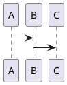
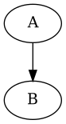

markdown tutorial
============

AUTHORS: Ray Kuo

文章簡介
------

主要說明markdown如何使用.並建立空的template,開箱即用

目錄
------

* [第 01 天：TODO](01.md)
* [第 02 天：TODO](02.md)

markdown中使用PlantUML
---------------------

```puml
A -> B
```





參考連結
------

* [用筆記也可以管理專案(二)：Markdown Preview Enhanced](https://jonny-huang.github.io/projects/02_markdown_preview_enhanced/)
* [TODO](http://TODO/TODO/)
* [TODO](http://TODO/TODO/)
* [TODO](http://TODO/TODO/)

-------
* [HOME](../README.md)
* [回目錄](README.md)
* [下一天：TODO](./01.md)
-------